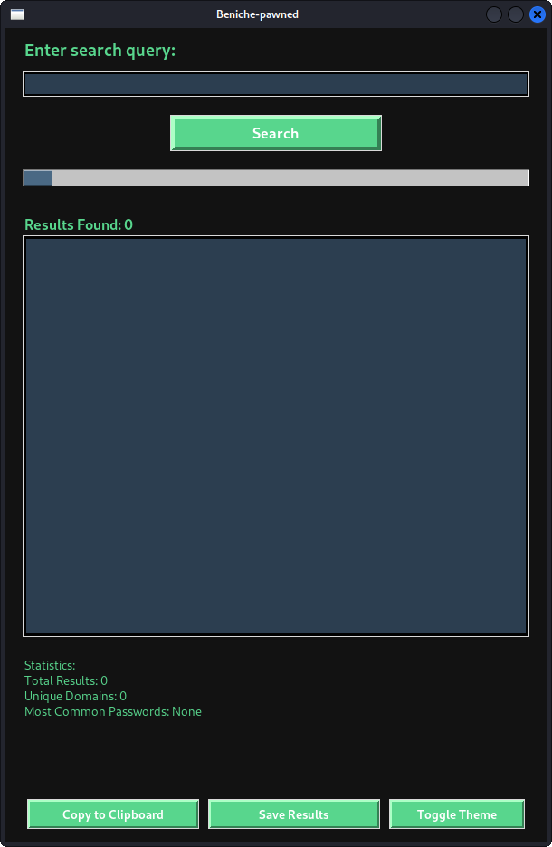

# Beniche-pawned

Beniche-pawned is a Python-based GUI application that allows users to search for compromised email:password combinations using an external API. The application provides features like theme toggling, password strength evaluation, and result statistics. It is built using the `tkinter` library for the GUI and `requests` for API interactions.

---

## Features

- **Search Functionality**: Query an external API for email:password combinations.
- **Theme Toggling**: Switch between dark and light modes.
- **Password Strength Evaluation**: Check the strength of passwords found in the results.
- **Statistics**: Display statistics like total results, unique domains, and most common passwords.
- **Copy to Clipboard**: Copy selected results to the clipboard.
- **Save Results**: Save search results to a text file.
- **Clear Results**: Clear the results list and reset the interface.

---

## Installation

### Prerequisites

- Python 3.x
- `requests` library (install via `pip install requests`)

### Steps

1. Clone the repository:
   ```bash
   git clone https://github.com/your-username/Beniche-pawned.git
   cd Beniche-pawned
2.run the application :

    python beniche_pawned.py
3.usage :

    Enter a Search Query: Type your query (e.g., an email or domain) into the search box.

    Search: Click the "Search" button to fetch results.

    View Results: Results will appear in the listbox. If your query is found in the results, they will be highlighted in red, and a security alert will be displayed.

    Copy or Save Results: Use the "Copy to Clipboard" or "Save Results" buttons to manage the results.

    Toggle Theme: Switch between dark and light modes using the "Toggle Theme" button.

    Clear Results: Use the "Clear Results" button to reset the interface.

   4.Screenshots
   
